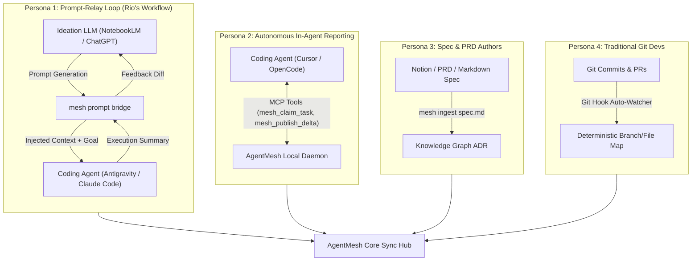
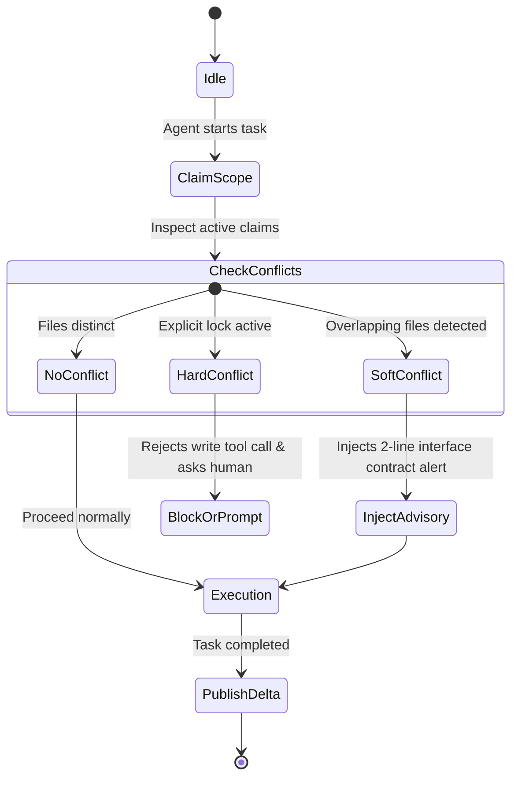

# 🕸️ AgentMesh: Architectural Blueprint & Master Implementation Plan

> **Project Name**: `AgentMesh`  
> **CLI Command**: `mesh`  
> **Tagline**: The Open-Source Service Mesh for AI Coding Agents. Align multi-developer agents, prevent context drift, and eliminate code collisions.  
> **License**: Apache 2.0 / MIT (Community Open Source)

---

## 1. Executive Summary & Core Paradigm

Modern software development teams are experiencing severe **context fragmentation**:
- Team members use disparate LLMs for ideation (**Gemini, NotebookLM, ChatGPT**) and disparate harnesses for execution (**Antigravity CLI/2.0, Claude Code, OpenCode, Cursor**).
- Each agent operates in an isolated silo, unaware of concurrent schema changes, active branches, or architectural decisions being made simultaneously on other team members' machines.
- **Scale**: Architected from the ground up to support **any number of developers ($N$)** and **any number of concurrent agents ($M$)** across distributed machines, repositories, and timezones—from a 2-person startup to a 500+ engineer enterprise.
- **AgentMesh** is the coordination layer that connects these heterogeneous human-agent pairs into a synchronized mesh with **zero token waste**, **real-time conflict radar**, and an **omniscient Super Orchestrator**.

---

## 2. Universal Ingestion: Designed for Every Developer Persona

To ensure AgentMesh is broadly adopted by both professional software engineers and casual builders, it supports 4 distinct collaboration workflows:

1. **Workflow A (The Prompt-Relay Loop)**:
   - Developer asks Gemini / NotebookLM: *"Help me design the prompt for my coding agent to build X"*.
   - `mesh prompt bridge`: Captures the prompt, enriches it with active team constraints (e.g. current schemas, active locks), sends it to the agent, and packages the agent's output back into a clean prompt ready to paste back into the ideation LLM.
2. **Workflow B (Autonomous In-Agent Tooling via MCP)**:
   - For hands-off developers: The coding agent directly calls MCP tools (`mesh_claim_task`, `mesh_query_context`, `mesh_publish_delta`) in the background without requiring manual developer input.
3. **Workflow C (Direct Spec & ADR Ingestion)**:
   - For product managers and architects: Drag-and-drop or run `mesh ingest design_doc.md` to instantly extract architectural constraints into the team graph.
4. **Workflow D (Git-Native Silent Tracking)**:
   - For team members who don't use agents: A lightweight git hook silently reports active branches, staged diffs, and commits so all AI agents on the team stay aware of human code changes.

---

## 3. Backend Technology Evaluation: Go vs. Rust vs. TypeScript

For your team review, here is the objective comparison between the candidate backend technologies:

| Criteria | Go (Golang) ⭐ *(Recommended)* | Rust | TypeScript / Node (Fastify) |
| :--- | :--- | :--- | :--- |
| **Distribution** | Single static binary (`mesh-hub`). 15MB. Zero dependencies. | Single ultra-lean binary. 10MB. Zero dependencies. | Requires Node runtime or bulky Bun standalone compilation. |
| **Concurrency & WebSockets** | **Best-in-class.** Goroutines handle thousands of agent connections with minimal RAM (~20MB idle). | Unmatched raw performance and zero memory safety bugs, but higher code complexity. | Event loop easily saturated if parsing large diffs or embedding streams without worker threads. |
| **Community Contribution Speed** | High. Clean, readable code. Fast onboarding for open-source contributors. | Lower velocity. Strict borrow-checker slows down rapid feature prototyping. | High. Huge pool of web/JS developers. |
| **Embedded DB Support** | Excellent (`modernc.org/sqlite` or `duckdb`). | Excellent (`rusqlite`). | Good (`better-sqlite3`), but native bindings can break across OS platforms. |

### Recommendation for Team Review:
- **Core Hub & CLI**: **Go (Golang)**. It produces an instant, single-binary cross-platform executable (`macOS`, `Linux`, `Windows`) that runs anywhere in 1 command with minimal RAM.
- **Web Dashboard**: **TypeScript + Next.js / SvelteKit / Vite + Tailwind**, consuming the Go Hub's REST/WebSocket endpoints.

---

## 4. Conflict Enforcement Logic: Soft Advisory vs. Hard Lock

To prevent agents from overwriting each other's work:

- **Soft Advisory (Default Mode)**:
  - When Agent 1 touches `server/auth.ts` while Agent 2 is also working on `server/auth.ts`:
  - Neither agent is blocked.
  - Both agents receive a dynamic prompt injection:
    > `[AgentMesh Advisory]`: Teammate Harsh's agent is editing `server/auth.ts` on branch `feature/jwt`. Interface agreement: do not change function signatures; use Bearer tokens.
- **Hard Lock Mode (`mesh lock <file/dir>` or `--strict-locks`)**:
  - Used during sensitive refactoring (e.g. database migrations, core types).
  - An agent attempting to modify a locked file receives a tool error with instructions to contact the lock owner.

---

## 5. Strict Token Economics & Edge Distillation Engine

To keep AI costs near zero:
1. **0 Tokens Upfront**: Team context is queried **on demand** through MCP tools rather than stuffed into every prompt.
2. **Deterministic Processing**: Git branch detection, file hash diffing, and user locks use **0 LLM tokens**.
3. **Cheap Distillation Tier**:
   - Long 20k-token agent transcripts are never sent to expensive models.
   - A local parser or **Gemini 2.5 Flash-Lite / fast local model** extracts a standardized 3-bullet **Architectural Delta** (~50 tokens):
     - `Added`: Methods/endpoints added.
     - `Modified`: Schema or signature changes.
     - `Contract`: Inter-module dependencies created.

---

## 6. The Super Orchestrator ("Mesh Oracle")

The Super Orchestrator acts as the unified intelligence layer over the entire project:
- **Cross-Repo & Cross-Team Q&A**:
  - `mesh ask "What is the status of the payment gateway across all branches?"`
  - Returns real-time status synthesized from active tasks, recent ADRs, and git commits.
- **Semantic Drift Detection**:
  - Continuously compares the high-level design specs (from NotebookLM/Gemini) against the actual code changes submitted by coding agents.
  - Warns: *"Warning: The frontend agent implemented session cookies, but the architecture doc specifies JWT tokens."*

---

## 7. Multi-Phase Implementation Roadmap

### Phase 1: The Core Foundation (MVP)
- [ ] Initialize `agentmesh` monorepo (Go Hub + TypeScript Web UI + MCP Server).
- [ ] **AgentMesh Hub (Go)**:
  - In-memory + SQLite state store for tasks, file claims, and members.
  - WebSocket sync bus for real-time events.
- [ ] **AgentMesh CLI (`mesh`)**:
  - `mesh init`: Configures project workspace ID and repo mapping.
  - `mesh status`: Displays active developers, tasks, and file locks.
  - `mesh claim <task>` / `mesh release`: Manual task claiming.
- [ ] **AgentMesh MCP Server**:
  - Exposes `mesh_get_team_status`, `mesh_claim_scope`, and `mesh_publish_delta` to Antigravity CLI and Claude Code.

### Phase 2: Conflict Radar & Distillation Engine
- [ ] Implement Git Watcher hook (monitors branch checkouts and uncommitted diffs).
- [ ] Soft Advisory conflict detection engine.
- [ ] Micro-Distillation worker (uses Gemini Flash-Lite to compress completed agent tasks into 50-token Architectural Deltas).
- [ ] Prompt Bridge CLI command (`mesh prompt-bridge`) for bidirectional NotebookLM/Gemini relay.

### Phase 3: Web Dashboard & Super Orchestrator
- [ ] Modern Web Dashboard:
  - Live Radar: Real-time visual map of repositories, active branches, and file locks.
  - Activity & ADR Stream: Searchable timeline of architectural decisions.
  - Ideation Ingestion Deck: Paste or drop brainstorming documents to auto-extract tasks.
- [ ] Super Orchestrator Terminal & Web Chat (`mesh ask`).

### Phase 4: Open-Source Community Launch
- [ ] Multi-platform binary releases via GitHub Actions (`goreleaser` for macOS, Linux, Windows).
- [ ] Docker Compose & 1-click cloud deployment templates (Fly.io, Railway, Render).
- [ ] Comprehensive documentation, landing page, and benchmark showcasing token cost savings.
