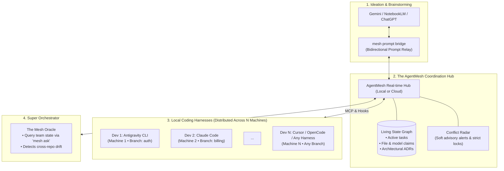

<div align="center">

# 🕸️ AgentMesh
### The Open-Source Coordination Fabric for Multi-Agent Software Engineering

[](https://opensource.org/licenses/MIT)
[](https://modelcontextprotocol.io)
[](#harness-support)
[](#token-economics)

**Stop your AI agents from stepping on each other.**  
Align any number of developers and AI agents ($N$ developers, $M$ agents) across distributed machines and repositories with real-time conflict radar, zero-token context sync, and an omniscient Super Orchestrator. Scalable from a 2-person hackathon team to a 100+ engineer enterprise.

[Blueprint & Spec](BLUEPRINT.md) • [Features](#-key-features) • [Architecture](#-architecture) • [Workflows](#-universal-workflows) • [Quickstart](#-quickstart) • [Roadmap](#-roadmap)

</div>

---

> 💡 **Community & Team RFC**: We are actively gathering feedback on the technical design and backend language selection (Go vs. Rust). Check out the full **[Architectural Blueprint & Implementation Plan (BLUEPRINT.md)](BLUEPRINT.md)** to review and contribute suggestions!

---

## 🚨 The Problem: Multi-Agent Context Silos & Collision

When individual software engineers work alongside AI agents, they use different tools:
- **Ideation & Brainstorming**: Gemini, NotebookLM, ChatGPT, Claude.
- **Coding & Execution**: Google Antigravity CLI / 2.0, Claude Code, OpenCode, Cursor, Aider.

### What happens in teams today:
1. **Context Blindness**: Dev 1's agent refactors the database schema in branch `feature/auth`. Dev 2's agent on another machine builds an API assuming the old schema. Both write valid code that catastrophically collides at merge time.
2. **Token Drain**: Dumping entire conversation transcripts or team logs into every prompt explodes API token costs and dilutes agent attention.
3. **The Ideation-Code Disconnect**: Architectural decisions discussed in NotebookLM or ChatGPT brainstorming threads rarely make it into coding agents without tedious manual copying.

---

## 💡 The Solution: AgentMesh



---

## ✨ Key Features

- **⚡ Zero-Token Idle Footprint (Pull vs Push)**: Agents are not bloated with unsolicited team logs. Context is fetched on demand via standard **Model Context Protocol (MCP)** tools.
- **🎯 Live Conflict Radar**: Detects when two agents or developers on different machines touch overlapping files or data models. Employs smart non-blocking **Soft Advisories** with suggested interface contracts, plus optional **Strict Locks**.
- **🌐 Monorepo & Multi-Repo Topology**: Seamlessly coordinates teams whether they work in a single monorepo or across dozens of distributed micro-repositories.
- **🧠 The Super Orchestrator (`mesh ask`)**: A global oracle that answers cross-team status, tracks progress, and detects architectural drift before code is committed.
- **🔁 Universal Collaboration Loops**: Out-of-the-box workflows designed for every persona—from prompt-relay builders to hands-off autonomous agents and traditional git engineers.

---

## 🔄 Universal Workflows

### 1. The Prompt-Relay Loop (NotebookLM / Gemini $\leftrightarrow$ Coding Agent)
If you brainstorm in Gemini or NotebookLM:
1. Ask your ideation model for the task prompt.
2. Run `mesh prompt bridge`: AgentMesh automatically enriches the prompt with active team constraints (schemas, locks) and pipes it to Antigravity CLI or Claude Code.
3. When the agent finishes, `mesh` summarizes the execution diff back into your clipboard ready to paste into your ideation LLM for review.

### 2. Autonomous In-Agent Tracking (MCP Native)
For hands-off coding:
- The coding agent automatically calls standard MCP tools:
  - `mesh_claim_task`: Registers task scope and touched files.
  - `mesh_query_context`: Checks if any teammate recently modified dependencies.
  - `mesh_publish_delta`: Emits a compact 50-token architectural summary upon completion.

### 3. Direct Spec & ADR Ingestion
- Drop design docs or PRDs via `mesh ingest architecture.md`. AgentMesh indexes architectural decisions and alerts agents when their code contradicts the spec.

### 4. Git-Native Silent Tracking
- Developers who do not use AI agents are automatically tracked via a zero-overhead git hook that registers active branches and touched files.

---

## 🚀 Quickstart

### Installation
```bash
# Install the AgentMesh CLI & Local Daemon
npm install -g agentmesh
# or via Homebrew / Binary
brew install agentmesh/tap/mesh
```

### Initialize in your project
```bash
cd your-project
mesh init
```

### Check live team radar
```bash
mesh status
```

### Query the Super Orchestrator
```bash
mesh ask "What is the status of the auth service refactor across all branches?"
```

---

## 🧩 Harness Support

AgentMesh integrates natively via the **Model Context Protocol (MCP)** and local hooks:
- [x] **Google Antigravity CLI & Antigravity 2.0 / IDE**
- [x] **Claude Code**
- [x] **Cursor**
- [x] **OpenCode / OpenHands**
- [x] **Aider**

---

## 🗺️ Roadmap

- [x] **Phase 0**: Architecture design & token-optimization specification.
- [ ] **Phase 1 (In Progress)**: Core Coordination Hub, `mesh` CLI, and standard MCP Server.
- [ ] **Phase 2**: Conflict Radar engine, Prompt Bridge relay, and Micro-Distillation worker.
- [ ] **Phase 3**: Web Dashboard with interactive radar, ADR stream, and Web Oracle chat.
- [ ] **Phase 4**: Multi-platform binary releases and 1-click cloud templates (Fly.io, Railway, Docker).

---

## 📄 License

AgentMesh is open-source software licensed under the [MIT License](LICENSE).
